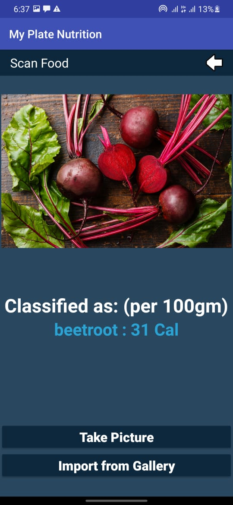
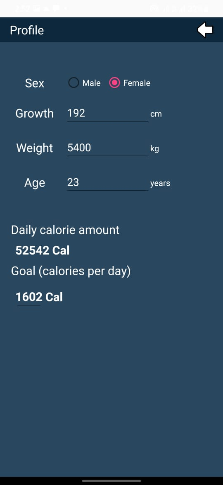
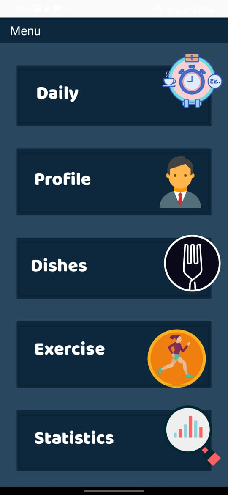
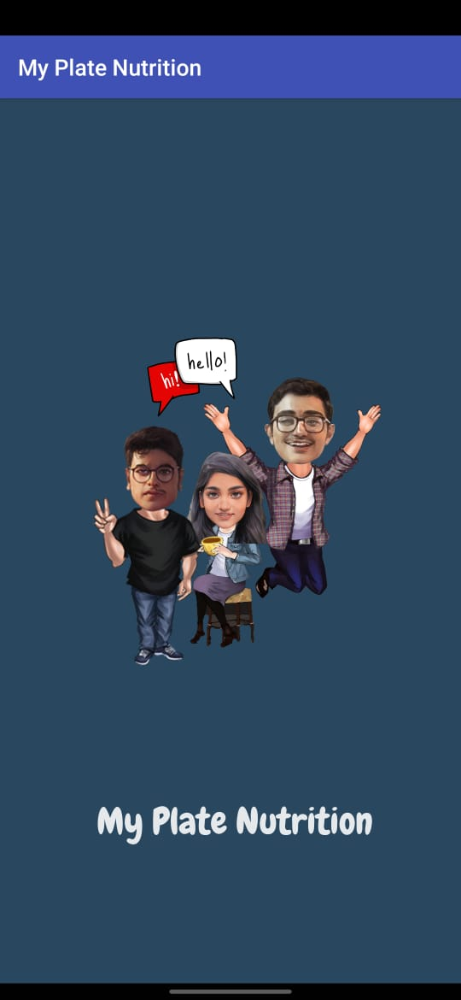
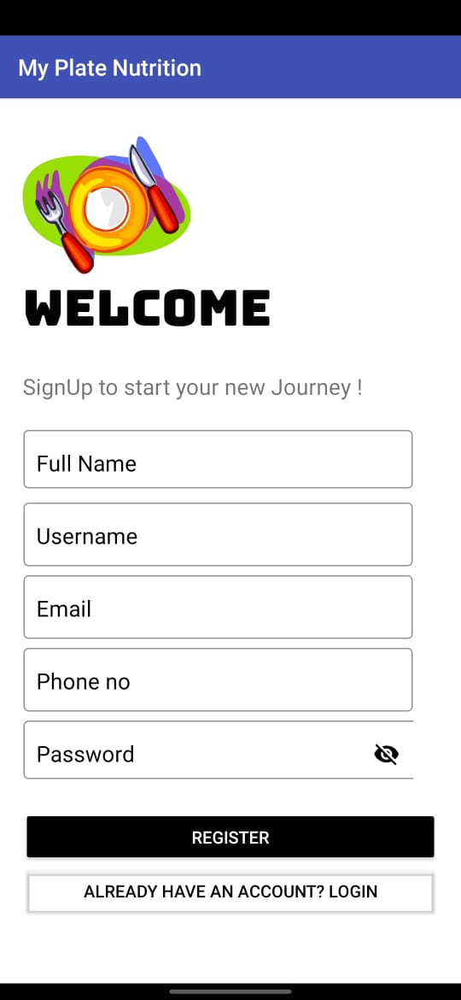

# My Plate Nutrition Android Application

**Summary:**
It is a nutrition tracker app(android application), helps to keep track of your daily eating habits by logging all the food you eat so you know how many calories you have consumed, plus the calories you burn by working out.

Just click a picture of food item and our ML algorithm will scan the food item and pull in the calorie count. And give you entire day nutrition consumption. Or you can just select/add food item manually based on the need*.

Flow chart:

### Menu

1. daily
2. profile
3. dishes
4. exercise
5. statistics
6. scan a food item

### Profile

1. Gender, Height, weight, age
2. Calorie amount(cal)
3. calorie goal(cal)

### Daily

1. calorie consumption
2. total exercise
3. daily summary
4. calender

### Statistics

bar chart of consumed food

### Samples
  &nbsp; &nbsp;    &nbsp; &nbsp;    

 

   &nbsp; &nbsp;   &nbsp; &nbsp; 

